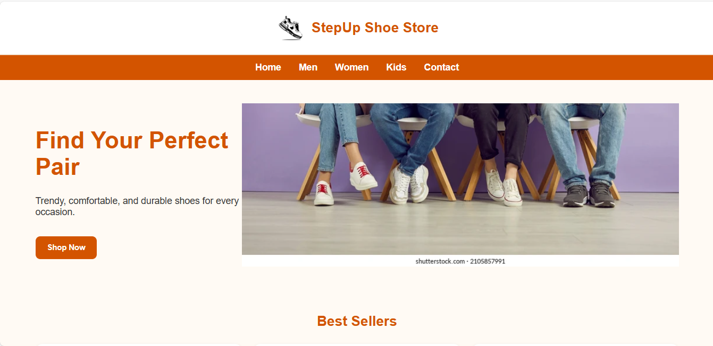

# 🌐 Mobile Friendly Website with CSS Media Queries

A simple responsive webpage built with **HTML5** and **CSS3**, showcasing how to make a desktop-only page **mobile-friendly** using **CSS media queries**.  

---

## 🚀 Features
- Responsive layout that adapts to **desktop, tablet, and mobile**
- Navigation optimized for smaller screens
- Flexible content sections that stack on mobile
- Clean and organized project structure

---

## 🛠 Tech
- HTML5  
- CSS3  
- Chrome DevTools  
- VS Code  

---

## 📸 Screenshots
### 🖥️ Desktop View  


### 📱 Mobile View  


---

## ▶️ Run Locally
Clone the project and open it in your browser:

```bash
git clone https://github.com/Aamir211/Mobile-friendly-website
cd mobile-friendly-website
